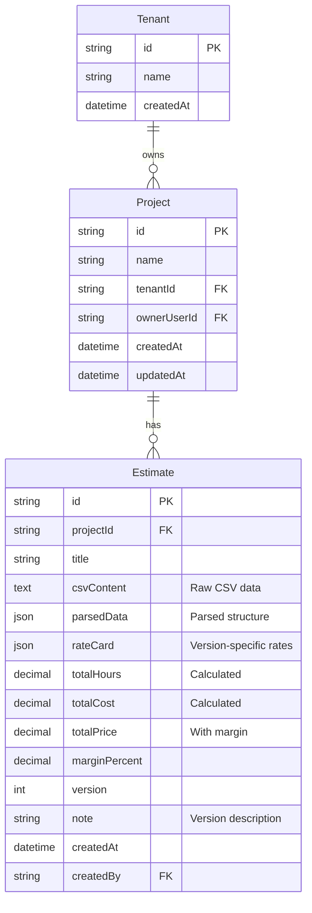
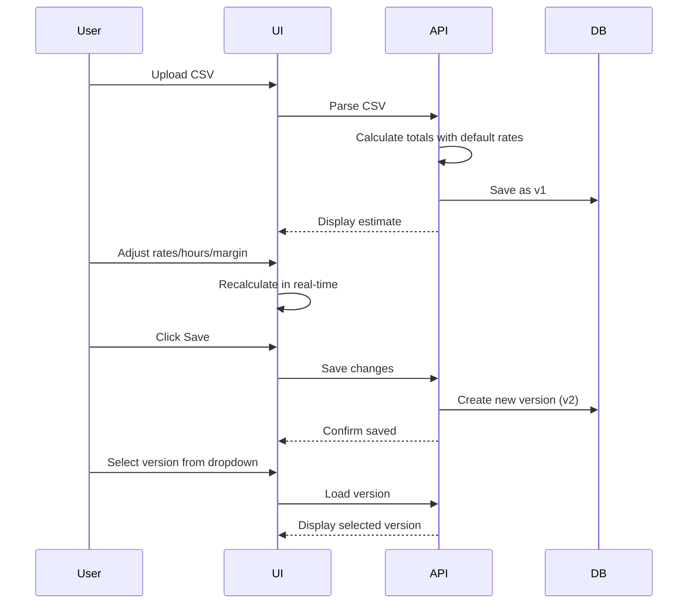

## Introduction

Akazi Estimate is a **Next.js‑based web application** that replaces the current Excel workbook used by Aerion / DevReady to create development estimates. Non‑technical project managers paste a CSV dump (exported from DevReady.ai) containing *module → user story → task → estimate* rows.
The system parses the CSV into a JSON structure, calculates roll‑ups (hours, cost, margin), and displays an interactive estimation view where users can adjust values in real-time. Each save creates a new version for complete history tracking.

---

## Tech Stack

| Layer             | Technology                                           | Rationale                                                                                |
| ----------------- | ---------------------------------------------------- | ---------------------------------------------------------------------------------------- |
| Front‑end         | **Next.js 15.3.3 (App Router, React Server Components)** | SEO‑friendly, fast SSR/ISR; same framework the team already uses for marketing sites.    |
| Component Library | **ShadCN + Radix UI + Tailwind CSS**                 | Production-ready accessible components with consistent theming via CSS variables.         |
| State Mgmt        | React Context + Zod schema validation                | Lightweight; Zod reused for client & server validation.                                  |
| Back‑end API      | **Next.js API Routes** + Server Actions              | Built-in API layer with form actions; no separate backend needed for MVP.                |
| Database          | **PostgreSQL + Prisma ORM**                          | Type-safe database access with migration management and multi-tenant architecture.       |
| Auth              | **Kinde Auth** + SSO (OAuth)                         | Enterprise-grade auth with multi-tenancy, M2M tokens, and role-based access control.     |
| Deployment        | **Vercel** (web + database)                          | CI/CD built‑in; global edge caching with integrated PostgreSQL.                          |
| Observability     | **Vercel Analytics** + structured logging            | Performance monitoring and error tracking with JSON logs.                                |

---

## 1. Overview

### Purpose

Replace multi‑sheet Excel estimation with a **single‑source‑of‑truth web application** that:

* Accepts a CSV of task estimates exported from DevReady.ai
* Automatically calculates hours and cost by module 
* Provides interactive UI to adjust estimates, rates, and margins
* Saves each change as a new version for complete history
* Displays clean, referenceable data for proposal creation

### Goals & Success Criteria

| #  | Goal                          | KPI / Target                                                                  |
| -- | ----------------------------- | ----------------------------------------------------------------------------- |
| G1 | Cut estimate preparation time | **≤ 5 minutes** from CSV upload to final estimate                             |
| G2 | Eliminate formula errors      | **0** calculation defects reported in first 3 months                          |
| G3 | Enable version tracking       | Every save creates new version with complete history                          |
| G4 | Support growth                | Handle projects up to **20 modules / 5k tasks** with instant calculations     |

### Scope

**In Scope:**
- CSV ingestion and parsing
- Interactive estimation UI with real-time calculations
- Adjustable rates per project/version
- Automatic versioning on save
- Version comparison and switching
- Multi-tenant data isolation

**Out of Scope (for MVP):**
- PDF generation
- Review/approval workflow
- Email notifications
- In‑browser WYSIWYG editing of individual tasks (just adjust hours/rates)
- Automated pricing rules
- Multi‑currency support

---

## 2. Simplified Data Model

### Target Data Model (Lean MVP)



### Entity Specifications

| Entity       | Field          | Type         | Description                                              |
| ------------ | -------------- | ------------ | -------------------------------------------------------- |
| **Project**  | id             | UUID         | Project container for all estimate versions              |
|              | name           | String       | Project name (e.g., "ACME Corp Website")                |
| **Estimate** | id             | UUID         | Unique estimate version                                  |
|              | version        | Integer      | Auto-incrementing version number                         |
|              | csvContent     | TEXT         | Original CSV data                                        |
|              | parsedData     | JSON         | Hierarchical module/story/task structure                 |
|              | rateCard       | JSON         | Version-specific role/region rates                       |
|              | totalHours     | Decimal      | Sum of all task hours                                    |
|              | totalCost      | Decimal      | Hours × rates                                            |
|              | totalPrice     | Decimal      | Cost × (1 + margin%)                                     |
|              | marginPercent  | Decimal      | Applied margin percentage                                |

---

## 3. Data Structures

### parsedData JSON Structure

```json
{
  "modules": [
    {
      "id": "module-1",
      "name": "Document Management",
      "userStories": [
        {
          "id": "story-1",
          "title": "Upload Documents",
          "tasks": [
            {
              "id": "task-1",
              "description": "Design upload interface",
              "estimateHours": 8.0,
              "role": "UI Designer",
              "region": "US"
            }
          ]
        }
      ]
    }
  ],
  "summary": {
    "totalHours": 120.5,
    "byRole": { "UI Designer": 40, "Backend Dev": 80.5 },
    "byRegion": { "AUS": 60, "Nepal": 60.5 }
  }
}
```

### rateCard JSON Structure

```json
{
  "rates": [
    {
      "role": "UI Designer",
      "region": "AUS",
      "ratePerHour": 150
    },
    {
      "role": "Backend Dev",
      "region": "Nepal",
      "ratePerHour": 75
    }
  ],
  "defaultRate": 100
}
```

---

## 4. User Workflow

### Estimation Creation Flow



---

## 5. UI Components

### Main Estimation View

```
┌─────────────────────────────────────────────────────────────┐
│ Project: ACME Corp Website    Version: [v3 ▼] [Save] [New] │
├─────────────────────────────────────────────────────────────┤
│                                                             │
│ ┌─────────────────────────────────────────────────────┐   │
│ │ Summary                                Margin: [25%] │   │
│ │ Total Hours: 120.5                                  │   │
│ │ Total Cost: $10,275                                 │   │
│ │ Total Price: $12,844 (with 25% margin)             │   │
│ └─────────────────────────────────────────────────────┘   │
│                                                             │
│ ┌─────────────────────────────────────────────────────┐   │
│ │ Rate Card (Editable)                                │   │
│ │ UI Designer    | US    | $[150]/hr                  │   │
│ │ UI Designer    | India | $[80]/hr                   │   │
│ │ Backend Dev    | US    | $[175]/hr                  │   │
│ │ Backend Dev    | India | $[75]/hr                   │   │
│ │ [+ Add Rate]                                        │   │
│ └─────────────────────────────────────────────────────┘   │
│                                                             │
│ ┌─────────────────────────────────────────────────────┐   │
│ │ ▼ Module: Document Management (40 hrs, $4,200)      │   │
│ │   ▼ Story: Upload Documents (16 hrs)                │   │
│ │     • Design interface    | UI Designer/US | [8]hrs │   │
│ │     • Build API          | Backend/India  | [8]hrs │   │
│ │   ▼ Story: Search Documents (24 hrs)                │   │
│ │     • Search UI          | UI Designer/US | [8]hrs │   │
│ │     • Search backend     | Backend/India  | [16]hrs│   │
│ └─────────────────────────────────────────────────────┘   │
└─────────────────────────────────────────────────────────────┘
```

### Version Selector

```
Version History:
┌──────────────────────────────────────────────┐
│ v3 (current) - 2024-01-21 10:30 AM          │
│ Note: Adjusted rates for India team         │
├──────────────────────────────────────────────┤
│ v2 - 2024-01-21 09:15 AM                    │
│ Note: Added 25% margin                      │
├──────────────────────────────────────────────┤
│ v1 - 2024-01-21 08:00 AM                    │
│ Note: Initial upload from CSV               │
└──────────────────────────────────────────────┘
```

---

## 6. Technical Details

### Real-time Calculations

All calculations happen client-side for instant feedback:

```typescript
// When user changes a value
const calculateTotals = (data: ParsedData, rateCard: RateCard, margin: number) => {
  let totalCost = 0;
  
  data.modules.forEach(module => {
    module.userStories.forEach(story => {
      story.tasks.forEach(task => {
        const rate = rateCard.rates.find(
          r => r.role === task.role && r.region === task.region
        )?.ratePerHour || rateCard.defaultRate;
        
        totalCost += task.estimateHours * rate;
      });
    });
  });
  
  const totalPrice = totalCost * (1 + margin / 100);
  return { totalCost, totalPrice };
};
```

### Versioning Strategy

- Every save creates a new immutable version
- Version numbers auto-increment
- Original CSV preserved for audit trail
- Can branch from any version by loading it and saving changes

---

## 7. Non-Functional Requirements

| Category      | Requirement                                                                       |
| ------------- | --------------------------------------------------------------------------------- |
| Performance   | Parse 5k-line CSV < 2s; instant calculations on value changes                    |
| Scalability   | Vertical scaling OK for MVP; optimize queries for version listing                 |
| Security      | Multi-tenant isolation via Kinde; row-level security by tenant                   |
| Usability     | All editable fields clearly marked; changes reflected immediately                 |
| Data Integrity| Immutable versions; original CSV always preserved                                |

---

## 8. Future Enhancements (Post-MVP)

1. **Export Options**
   - Copy formatted data to clipboard
   - Export to Excel/CSV
   - API endpoint for external tools

2. **Advanced Features**
   - Version comparison/diff view
   - Bulk rate adjustments
   - Templates for common rate cards
   - Collaborative editing with locks

3. **Integration**
   - Direct import to proposal tools
   - Webhook on version save
   - API for programmatic access

---

## 9. Implementation Notes

### Database Indexes
- `Estimate(projectId, version DESC)` - Fast version listing
- `Project(tenantId, createdAt DESC)` - Project dashboard queries

### Caching Strategy
- Cache parsed CSV data in `parsedData` field
- Recalculate only on rate/margin changes
- No server round-trips for calculations

### Security Considerations
- Tenant isolation at database level
- Rate limiting on CSV uploads
- Max file size limits (e.g., 10MB)
- Input validation on all numeric fields

---

## 10. Calculation Model & Formula Mapping

*This section documents the exact maths that replaces the legacy **Pricing Refined MVP** sheet.  It is written so that both engineers and accountants can trace every number on‑screen back to a single constant or transformation.*

### 10.1 Business Constants (Percent Splits & Rates)

| Key             | Purpose                                               | **% Split** | **\$/hr Rate**      | Named in Code / Env  |
| --------------- | ----------------------------------------------------- | ----------- | ------------------- | -------------------- |
| **EXTRA\_LOAD** | Universal “buffer” hours added to every raw line item | `0.20`      | `NP_DEV_RATE` (100) | `extra.percent`      |
| **NP\_QA**      | QA performed by Nepal team                            | `0.30`      |  `80`               | `qa.nepal`           |
| **MELB\_QA**    | QA performed in Melbourne                             | `0.10`      |  `200`              | `qa.melb`            |
| **ENG\_AU**     | Additional AU‑based engineering oversight             | `0.05`      |  `200`              | `eng.au`             |
| **ENG\_NP**     | Additional Nepal engineering oversight                | `0.05`      |  `100`              | `eng.nepal`          |
| **PM\_LOAD**    | Project‑management overhead on all tech/QA hours      | `0.05`      |  `200`              | `pm.load`            |
| **COS\_MARGIN** | Cost‑of‑sale uplift applied after labour cost         | `0.10`      |  —                  | `costOfSale.percent` |

*All constants live in a single **rate‑card JSON** for versioning.  They can be edited via the “Rate Card” panel and are snapshot into every new version.*

---

### 10.2 Per‑Module Hour Calculations

For each module row *m* with **baseHours** extracted from the CSV:

| Column        | Formula                                                            | Comment                              |
| ------------- | ------------------------------------------------------------------ | ------------------------------------ |
| **extraHrs**  | `baseHours × (1 + EXTRA_LOAD)`                                     | Adds universal buffer                |
| **npQAhrs**   | `extraHrs × NP_QA`                                                 | QA split—Nepal                       |
| **melbQAhrs** | `extraHrs × MELB_QA`                                               | QA split—Melbourne                   |
| **engAUhrs**  | `extraHrs × ENG_AU`                                                | Engineering oversight AU             |
| **engNPhrs**  | `extraHrs × ENG_NP`                                                | Engineering oversight NP             |
| **pmHrs**     | `(extraHrs + npQAhrs + melbQAhrs + engAUhrs + engNPhrs) × PM_LOAD` | PM overhead on *all* preceding hours |

---

### 10.3 Per‑Module Cost Calculations

```text
moduleCost =
  extraHrs  × NP_DEV_RATE   +
  npQAhrs   × NP_QA_RATE    +
  melbQAhrs × MELB_QA_RATE  +
  engAUhrs  × ENG_AU_RATE   +
  engNPhrs  × NP_ENG_RATE   +
  pmHrs     × PM_RATE
plusCostOfSale = moduleCost × COS_MARGIN
```

Both **moduleCost** and **plusCostOfSale** are stored on the module object for drill‑down.

---

### 10.4 Roll‑ups & Build Totals

```text
totalHours   = Σ(extraHrs .. engNPhrs + pmHrs)
totalLabour  = Σ(moduleCost)
costOfSale   = totalLabour × COS_MARGIN
buildTotal   = totalLabour + costOfSale + discretionaryExtras
totalRounded = ceil(buildTotal)          // spreadsheet used CEILING(…,1)
```

*`discretionaryExtras` is a free‑text, per‑version dollar field (“DevReady extras”).*

---


### 10.7 Design Notes & Guard‑Rails

* **Single Source of Truth** – Only **baseHours**, **percents**, and **rates** are
  persisted; every other figure is derived.
* **Immutability** – Saving creates a *new* version containing snapshots of constants
  so historical quotes never change retroactively.
* **Validation** – All percents must sum to ≤ 1; rates must be ≥ 0.  Violations
  return standard error codes (`ERR_PERCENT_TOTAL`, `ERR_NEG_RATE`).
* **Extensibility** – To add a new labour bucket (e.g. *Security Review*), simply
  add a percent+rate pair and extend the calculator—no schema change needed.

---

